# Factura de la luz

## 1. Objeto

El Real Decreto-ley 1/2019, de 11 de enero 1 , modifica las competencias de la
CNMC como autoridad reguladora nacional en relación a la metodología para el
establecimiento de los peajes de transporte y distribución. En particular,
establece que la CNMC deberá fijar, mediante circulares, previo trámite de
audiencia y con criterios de eficiencia económica, transparencia, objetividad y no
discriminación y de acuerdo con las orientaciones de política energética la
estructura y la metodología para el cálculo de los peajes de acceso a las redes
de electricidad destinados a cubrir la retribución del transporte y la distribución.
En cumplimiento de lo anterior, el pasado 24 de enero de 2020 fue publicado en
el Boletín Oficial del Estado la Circular 3/2020 2 , de 15 de enero, de la Comisión
Nacional de los Mercados y la Competencia, por la que se establece la
metodología para el cálculo de los peajes de transporte y distribución de
electricidad.
La Circular 3/2020 introduce algunos cambios respecto de la estructura y
condiciones de facturación de peajes de acceso vigentes. Estos cambios han
dado lugar a diversas consultas por parte de empresas, Comunidades
Autónomas y consumidores sobre diversos aspectos. El objeto del presente
anexo es aclarar las dudas planteadas por distintos agentes, con el fin de facilitar
la comprensión e implementación de la Circular 3/2020.
A los efectos anteriores, para facilitar la compresión de todos los agentes, se
procede en primer lugar, a enmarcar el contenido la Circular 3/2020 en el
esquema general precios al que debe hacer frente un consumidor por el
suministro de energía.

## 2. Peajes y cargos

Los consumidores en su factura de electricidad deben pagar además de la
energía que consumen, los peajes de acceso, el margen de comercialización y
los impuestos (impuesto eléctrico e impuesto sobre el valor añadido).

El componente de energía se determina en función de los precios del mercado
mayorista y, en su caso, de las condiciones libremente pactadas entre
consumidores y comercializadores, mientras que los peajes de acceso vigentes
son los precios regulados que deben pagar los consumidores para cubrir los
costes regulados del sistema eléctrico, tales como las redes de transporte y
distribución, la retribución de las energías renovables, el diferencial del coste de
energía de los territorios no peninsulares y las anualidades para cubrir el déficit
de tarifas de ejercicios anteriores. El margen de comercialización es el pago por
los servicios que presta el comercializador.
La Ley 24/2013, de 26 de diciembre, del Sector Eléctrico, introduce la
diferenciación de los peajes de acceso hasta entonces vigentes en dos
conceptos diferenciados: los peajes de acceso a las redes de transporte y
distribución y los cargos necesarios para cubrir el resto de los costes regulados.
La diferenciación de peajes y cargos responde a la terminología utilizada en las
directivas europeas y a la conveniencia de diferenciar los pagos por contribución
a la cobertura de los costes de las redes de transporte y distribución, peajes, de
aquellos pagos relacionados con otros costes regulados del sistema, cargos.
El Real Decreto-ley 1/2019, de 11 de enero, transfirió a la Comisión Nacional de
los Mercados y la Competencia la potestad para establecer, mediante circular, la
estructura y la metodología para el cálculo de los peajes de acceso a las redes
de electricidad destinados a cubrir la retribución del transporte y la distribución,
previo trámite de audiencia y con criterios de eficiencia económica,
transparencia, objetividad y no discriminación y de acuerdo con las orientaciones
de política energética.
Por otra parte, el Real Decreto Ley 1/2019, de 11 de enero, asigna al gobierno
la competencia para el desarrollo y aprobación de la metodología de cálculo de
los cargos que deberán satisfacer los consumidores y, en su caso, los
productores de energía eléctrica, y que se destinarán al resto de costes de
sistema 3 (entre otros, la retribución específica de la renovables, el extracoste de
generación en los territorios no peninsulares y las anualidades para la
recuperación del déficit).
En el ejercicio de esta competencia el pasado 24 de enero de 2020 fue publicada
en el Boletín Oficial del Estado la Circular 3/2020, de 15 de enero, por la que se
establece la metodología para el cálculo de los peajes de transporte y
distribución de electricidad.
El Real Decreto 148/2021, de 9 de marzo, por el que se establece la metodología
de cálculo de los cargos del sistema eléctrico, establece una estructura de

precios para los cargos consistente con la estructura de peajes definida en la
Circular 3/2020.
Los costes de las redes de transporte y distribución y los cargos se repercuten a
todos los consumidores según sus características, independientemente de que
el consumidor adquiera su energía través de un comercializador libre o esté
suministrado al Precio Voluntario para el Pequeño Consumidor (PVPC). Tanto
los peajes de transporte y distribución como los cargos son únicos en todo el
territorio nacional.
En relación con lo anterior, se indica que aquellos consumidores cuya potencia
contratada sea inferior a 10 kW pueden optar por contratar el suministro de
electricidad con un comercializador de referencia 4 o con un comercializador libre.
Los consumidores cuya potencia contratada sea superior a 10 kW deben
contratar el suministro de electricidad siempre con un comercializador libre.

a) Suministro de energía a través del comercializador de referencia. Este
precio se compone de la suma de los peajes de transporte y distribución, los
cargos, el coste de la energía y el coste del margen del comercializador de
referencia. Todos los componentes del PVPC son regulados a excepción del
coste de la energía que se establece con base en el precio horario registrado
en el mercado mayorista, así como el coste de los servicios de ajuste 5 . El
PVPC es el precio máximo que los comercializadores de referencia podrán
aplicar a sus clientes 6 .
b) Suministro de energía a través del comercializador libre. El precio final
de la electricidad en el mercado libre presenta los mismos componentes que
el PVPC, con la particularidad de que el coste de la energía y el margen de
comercialización son libremente establecidos por el comercializador.

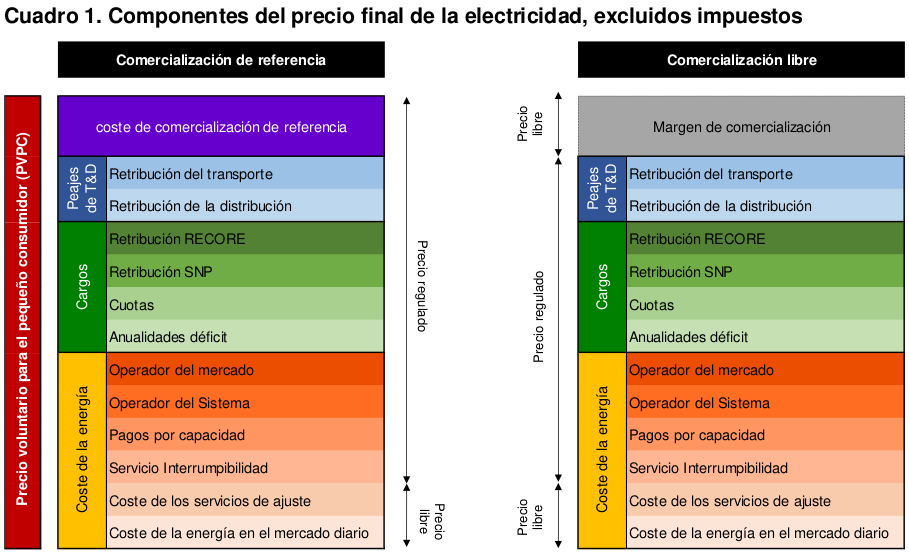

Como se verá más adelante la estructura de peajes y cargos definidas en la
Circular 3/2020 y el Real Decreto 148/2021, de 9 de marzo, por el que se
establece la metodología de cálculo de los cargos del sistema eléctrico difieren
de la estructura de peajes de acceso vigentes, siendo los cambios más
relevantes los relativos al número de periodos horarios de los que constan los
términos de facturación y la definición de los propios periodos horarios. Cabe
señalar en particular que, a partir de su entrada en vigor, todos los consumidores
tendrán peajes y cargos con precios diferenciados en función del momento en
que se consuma 7 . En particular, para todos los consumidores conectados en baja
tensión con potencia contratada inferior a 15 kW se diferencia el término de
energía en tres periodos (punta, llano y valle) y el término de potencia en dos
periodos (punta y valle). Para el resto de consumidores (incluidos los
actualmente acogidos a los peajes 3.0 A y 3.1 A) los términos de potencia y
energía del peaje constarán de seis periodos horarios.
La nueva estructura de peajes y cargos será de aplicación a partir del 1 de junio
de 2021, fecha de eficacia de los cargos a tenor del citado Real Decreto.

## 3. Ámbito de aplicación

La Circular será de aplicación para la determinación de los precios de los peajes
de acceso a las redes transporte y distribución de los consumidores, los

autoconsumidores por la energía consumida de la red y por la energía
autoconsumida en el caso instalaciones próximas a través de red, las
instalaciones de generación por sus consumos propios y los intercambios de
energía eléctrica que se realicen con destino en países no miembros de la Unión
Europea.
En consecuencia, quedan exentos del pago de peajes por el acceso a las redes
de transporte y distribución:
a) los productores de energía eléctrica por cada una de sus instalaciones por
la energía neta generada vertida a la red,
b) las empresas transportistas y distribuidoras por sus consumos propios,
c) la energía consumida por los bombeos de uso exclusivo para la
producción de energía eléctrica y las baterías de almacenamiento de
energía conectadas en la red de transporte o distribución.
Con respecto al ámbito de aplicación de los peajes se realizan las siguientes
aclaraciones:

El artículo 2.2.a) establece que quedan exceptuados del pago de peajes los
productores de energía eléctrica por las inyecciones en la red de transporte o
distribución. La excepción en el pago de estos peajes es de aplicación desde la
entrada en vigor de la Circular 3/2020, es decir, desde el sábado 25 de enero de
2020, conforme a lo establecido disposición final única de esta Circular.
Asimismo, según el artículo 2.2.b) están exentos del pago de peajes la energía
empleada por las empresas de transporte y distribución de energía eléctrica
como consumos propios para el funcionamiento de sus instalaciones, que tendrá
el mismo tratamiento que las pérdidas en sus redes. No es necesario solicitar el
reconocimiento de dichos consumos propios al Ministerio, al objeto de que sea
reconocida la exención en el pago. La excepción en el pago también se produce
desde el sábado 25 de enero de 2020.

## 4. Estructura de peajes

La Circular 3/2020, de 15 de enero, introduce los siguientes cambios respecto
de la estructura de peajes de acceso vigentes:
	 a) Se unifican en un único peaje, el peaje 2.0 TD, los peajes 2.0 A y 2.1 A en
todas sus modalidades (sin discriminación horaria, con discriminación horaria
nocturna y con discriminación horaria supervalle), introduciéndose, además,
la posibilidad de diferenciar la potencia contratada en dos periodos (punta y
valle) y la discriminación horaria del consumo en tres periodos para todos los
consumidores acogidos a este peaje.

b) El peaje vigente 3.0 A pasa a constar de seis términos de energía y seis
términos de potencia.
c) Los peajes de media tensión serán de aplicación a los suministros
conectados a redes de tensión superior a 1 kV e inferior a 30 kV, unificándose
los peajes 3.1 A y 6.1 en un único peaje, el peaje 6.1 TD.
d) A los consumidores conectados en redes de tensión superior a 30 kV e igual
o inferior a 72,5 kV les será de aplicación el peaje 6.2 TD,
independientemente de l
e) A los intercambios internacionales les será de aplicación el peaje 6.4 TD, con
las especificidades establecidas para los mismos en el artículo 9 de la
Circular 3/2020.

En el cuadro inferior se muestra la equivalencia entre la estructura de los peajes
de acceso vigentes y los peajes de transporte y distribución de la Circular 3/2020.

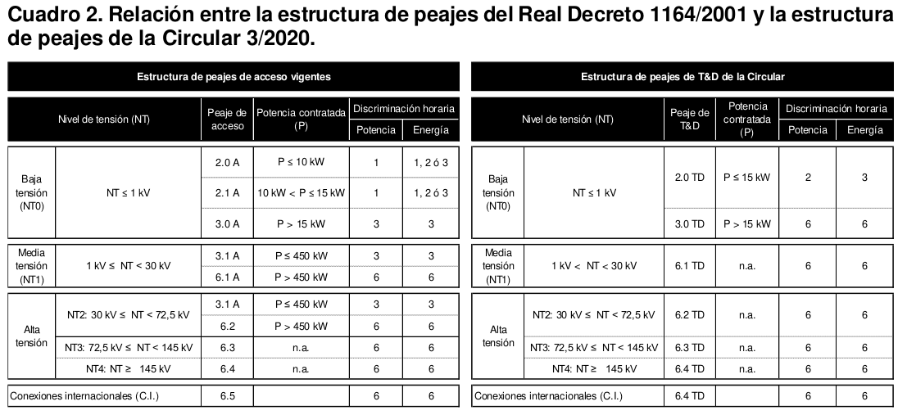

Adicionalmente, teniendo en cuenta las consultas recibidas, con respecto a la
definición de la estructura de peajes del artículo 6 se realizan las siguientes
aclaraciones:

• El peaje 2.0TD es de aplicación a suministros conectados en redes de tensión
no superior a 1 kV, con potencia contratada inferior o igual a 15 kW en todos
los periodos. Este peaje consta de dos términos de potencia contratada. Se
trata del único peaje para el que no aplica el requisito de potencias crecientes.
Es decir, la potencia contratada en el periodo de valle podrá ser superior o
inferior a la potencia contratada en el periodo de punta.
• En el Peaje 3.0 TD, de aplicación a los suministros de baja tensión con
potencia contratada superior a 15 kW en alguno de los seis períodos horarios,
no se establece ningún límite a la potencia contratada mínima en alguno de
los periodos, si bien la potencia contratada debe que ser superior a 15 kW en

alguno de los periodos. Tampoco se establece ningún límite a la potencia
contratada máxima, que dependerá de la máxima admisible de la instalación.
En este peaje las potencias contratadas son en orden igual o creciente.
• En el peaje 6.1 TD, de aplicación a los suministros conectados en tensiones
superiores a 1 kV e inferiores a 30 kV (nivel de tensión tarifario NT1) no se
establece ninguna limitación de potencia contratada mínima o máxima.
Desaparece, por tanto, el límite actual de que alguna de las potencias
contratadas sea superior a 450 kW. En este peaje las potencias contratadas
son en orden igual o creciente.

## 5. Periodos horarios

La Circular 3/2020 ha modificado, además de la estructura de peajes, la
definición de los periodos horarios para todos los consumidores.

Bajo la estructura de peajes vigentes, a los consumidores con potencia inferior o
igual a 10 KW les es de aplicación el peaje 2.0 A, pudiendo optar por no
diferenciar el consumo (esto es, todas las horas del día cuestan lo mismo) o bien
diferenciar el consumo en dos periodos (la denominada tarifa nocturna, en que
se aplican dos precios en función del momento del día en que se consume) o en
tres periodos (la denominada tarifa supervalle, en que se aplican tres precios
diferentes en función del momento del día en que se consume). Análogamente,
aquellos consumidores con potencia contratada mayor de 10 kW y menor o igual
de 15 kW (peajes 2.1 A) pueden optar por no diferenciar el consumo o por
diferenciarlo en dos o tres periodos horarios. Cabe señalar que en las
discriminaciones horarias vigentes no se diferencia entre días laborables,
sábados, domingos y festivos.
En el momento en que sea de aplicación la estructura de peajes establecida en
la Circular 3/2020, todos los consumidores conectados en redes de baja tensión
con potencia contratada inferior o igual a 15 kW estarán acogidos al mismo peaje
de redes (denominado en la Circular peaje 2.0 TD) y pasarán a disponer de una
estructura de precios diferenciada en dos periodos para la potencia (punta y
valle) y tres periodos (punta, llano y valle) para la energía. Se indica que el
periodo de punta definido para la potencia resulta de la agregación de los
periodos de punta y llano definidos para la energía.
En el cuadro inferior se comparan las posibles discriminaciones horarias a las
que puede optar un consumidor bajo la estructura de peajes de acceso vigentes
con la discriminación horaria de la Circular 3/2020. Se indica que los periodos
horarios de punta y llano de la Circular 3/2020 se desplazan una hora hacia
adelante en las Ciudades Autónomas de Ceuta y Melilla.

Como se ha indicado, los consumidores conectados en baja tensión con potencia
contratada superior a 15 kW (peaje 3.0 A) y los consumidores conectados en
media tensión con potencia contratada inferior a 450 kW (peaje 3.1 A) pasarán
de una discriminación horaria de tres periodos a una discriminación horaria de
seis periodos. Bajo la estructura de peajes de acceso vigentes este colectivo de
consumidores de consumidores cuenta con una diferenciación de precios en tres
periodos en la que únicamente se considera una punta (de tarde en los meses
de invierno, y de mañana en los meses de verano). Adicionalmente, para el
colectivo de consumidores conectados en media tensión, se diferencia entre días
laborables y no laborables. Bajo la estructura de peajes de la Circular 3/2020,
todos los consumidores contarán con tres periodos horarios diferentes en los
días laborables.

Por último, en el cuadro inferior se compara la discriminación horaria de seis
periodos de aplicación a los peajes vigentes con los definidos en la Circular
3/2020. Se observa que, como consecuencia del reajuste de los periodos
horarios, todos los días laborables, independientemente de la temporada a la
que pertenezcan, contarán con la misma diferenciación de periodos, si bien el
nivel de precios de cada uno de los periodos variará en función de la temporada
a la que pertenezcan.

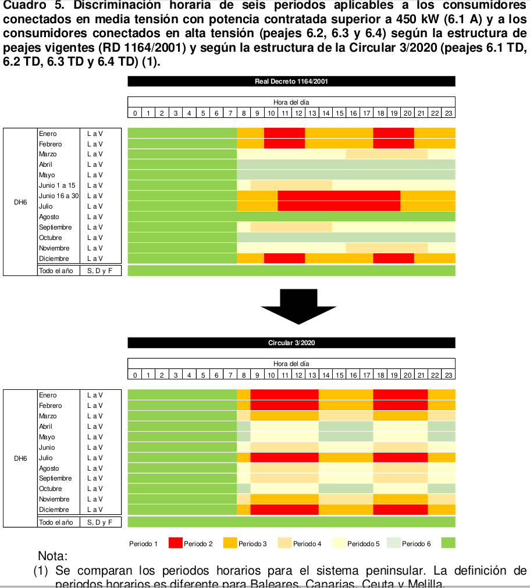

## 6. Condiciones de aplicación de los peajes de transporte y distribución

Conforme al artículo 9 de la Circular 3/2020, los peajes de transporte y
distribución constan de un término de facturación por potencia contratada, un
término de facturación por energía consumida y, en su caso, un término de
facturación por la potencia demandada y un término de facturación por la energía
reactiva.
No obstante, se plantean las siguientes particularidades:

a) A los consumidores conectados en baja tensión con potencia
contratada igual o inferior a 15 kW:
i. No les será de aplicación la facturación por potencia demandada
cuando dispongan de Interruptor de Control de Potencia (ICP).
ii. No les será de aplicación la facturación por energía reactiva.
b) En el ámbito de las conexiones internacionales:xx
i. Dado que no se contrata potencia, la facturación de potencia, en
cada período tarifario, se calculará multiplicando el precio
establecido para el término de potencia por la suma de las
potencias efectivamente programadas en cada hora divididas por
el número total de horas del período. En consecuencia, no
procede la facturación por potencia demandada.
ii. No será de aplicación el término de facturación de energía
reactiva.
c) De acuerdo con el artículo 5.6 del Real Decreto 1164/2001 los
suministros de socorro se tratarán como suministros independientes
y como tales se facturarán, excepto si la alimentación la realiza la misma
empresa distribuidora, en cuyo caso se facturará, únicamente, el 50 por
100 del término de potencia contratada del suministro de socorro.

En el resto de los casos, será de aplicación la facturación por potencia
demandada y por energía reactiva cuando proceda.

### 6.1. Facturación por potencia

La Circular 3/2020 establece que la facturación por potencia contratada será el
sumatorio resultante de multiplicar la potencia contratada en cada período
horario por el precio del término de potencia correspondiente, según la fórmula
siguiente:
$$
FP=\sum_{p=1}^{p=i}T_{P_p} * P_{C_p}
$$

Donde:

- $FP$: Facturación de la potencia
- $T_{P_p}$: Precio del término de potencia del periodo horario p,  expresado en €/kW y año
- $P_{C_p}$ Potencia contratada en el período horario p , expresada en kW.
- i :Número de periodos horarios de los que consta el término def acturación de potencia del peaje correspondiente.	

La facturación de potencia se prorrateará por el número de días de cada año
(normal o bisiesto), o el número de horas en el caso de contratos de duración
inferior al día, que comprende el periodo de facturación, considerando que el día
de lectura inicial está excluido y el día de lectura final está incluido.
A modo ilustrativo, en el Cuadro 6 se muestra la facturación por potencia
contratada para tres consumidores, acogidos a los peajes 2.0 TD, 3.0 TD y 6.1
TD, a los términos de potencia de la Resolución de 18 marzo de 20218, de la
Comisión Nacional de los Mercados y de la Competencia, por la que se
establecen los valores de los peajes de transporte y distribución para el ejercicio
2021 (recogidos en el Anexo I del documento) y que el periodo de facturación
comprende 30 días

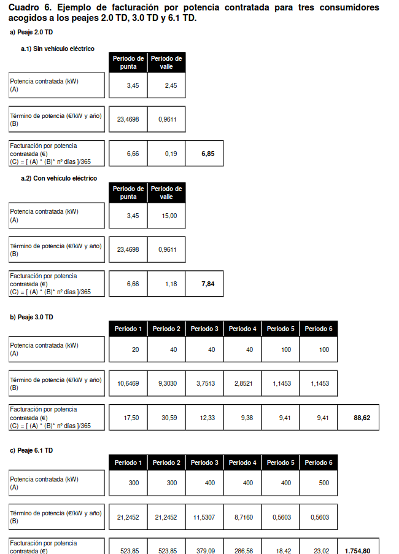

### 6.2. Facturación por energía

La Circular 3/2020 establece en el artículo 9.3 que la facturación por energía
activa será el sumatorio resultante de multiplicar la energía consumida o, en su
caso, estimada en cada período horario por el precio del término de energía
correspondiente, de acuerdo con la fórmula siguiente:

$$
FE=\sum_{p=1}^{p=i}T_{e_p} * E_p
$$
Donde:

* $FE$: Facturación por energía, expresada en €
* $T_{e_p}$: Precio del término de energía del periodo horario p , expresado en €/kWh
* $E_p$ : Energía consumida o estimada en el período horario p , expresada en kWh. En el caso de las * importaciones   exportaciones de energía se considerará la energía programada en cada periodo horario.
* i:Número de periodos horarios de los que consta el término de facturación de energía del peaje correspondiente

Siguiendo con el ejemplo anterior, en el Cuadro 7 se muestra la facturación por
energía activa para tres consumidores, acogidos a los peajes 2.0 TD, 3.0 TD y
6.1 TD en un mes de temporada alta 

### 6.3. Facturación por potencia demandada

La facturación por excesos de potencia tiene como objetivo proporcionar un
incentivo a los usuarios de las redes a contratar adecuadamente la potencia, a
efectos de evitar, por una parte, sobreinversiones en redes y, por otra parte,
minimizar la incertidumbre sobre la suficiencia de ingresos para cubrir la
retribución reconocida.
El control de la potencia demandada se realizará mediante los aparatos de
control y medida de acuerdo con lo dispuesto en el Reglamento unificado de
puntos de medida del sistema eléctrico, aprobado por el Real Decreto
1110/2007, de 24 de agosto. Conforme al artículo 7 del Reglamento, se
distinguen los siguientes tipos de puntos de medida en las fronteras de clientes:
a) Tipo 1: puntos de suministro con potencia contratada en cualquier periodo
igual o superior a 10 MW.
b) Tipo 2: puntos de suministro con potencia contratada en cualquier periodo
superior a 450 kW e inferior a 10 MW.
c) Tipo 3: aquellos puntos de suministro que no puedan clasificarse en otra
categoría
d) Tipo 4: Potencia contratada en cualquier periodo igual o inferior a 50 kW y
superior a 15 kW.
e) Tipo 5: puntos de suministro con potencia contratada en cualquier periodo
igual o inferior a 15 kW

Nótese que no existe una relación única entre los puntos de medida y los peajes
aplicables a los consumidores, con la excepción de los consumidores
conectados en baja tensión con potencia contratada inferior a 15 kW, clasificados
como Tipo 5 (englobados los peajes de acceso vigentes 2.0 A y 2.1 A y el peaje
de transporte y distribución 2.0 TD).
Con carácter general, los consumidores acogidos a los actuales peajes de
acceso 6.1, 6.2, 6.3 y 6.4 disponen de un equipo de medida tipo 1 o tipo 2,
mientras que los consumidores acogidos a los actuales peajes de acceso 3.0 A
y 3.1 A pueden disponer de diversos tipos equipos de medida, dependiendo de
la potencia que tengan contratada y del volumen de consumo anual.

Por otra parte, conforme al artículo 10 del Reglamento el cliente podrá optar a
su costa por disponer de equipos de medida de calidad o precisión superior a los
requeridos para el tipo de punto de medida en el que se encuentra clasificado.
Por lo que puede darse el caso, por ejemplo, de un cliente con potencia
contratada de 40 kW, punto de medida tipo 4, que tenga instalado un equipo
correspondiente a un punto de medida tipo 3.
Efectivamente, como se desprende del análisis de los cuadros siguientes,
existen puntos de suministro con un equipo de medida superior al que le
correspondería teniendo en cuenta la potencia contratada. A modo de ejemplo,
en el peaje 3.1 A en el año 2019 tenían una potencia contratada inferior a 15 kW
22.299 puntos de suministro, por lo que les hubiera correspondido un equipo de
medida tipo 5 (véase Cuadro 8), si bien únicamente 12.335 puntos de suministro
disponían de ese tipo de medida (véase Cuadro 9).

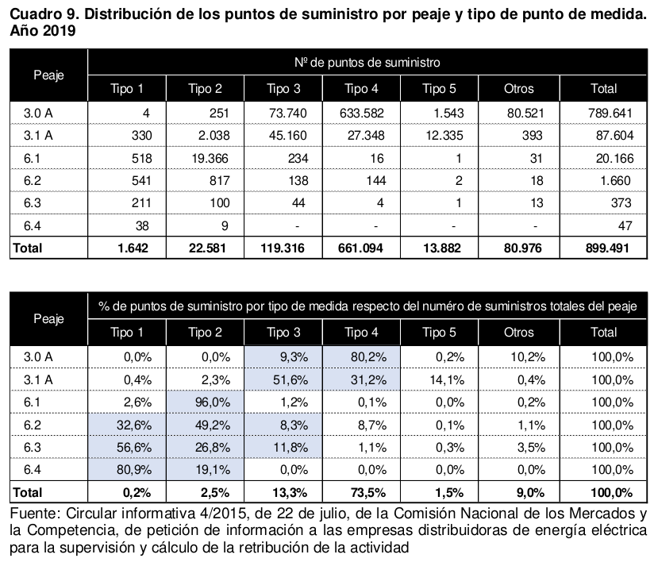

Teniendo en cuenta las consideraciones anteriores, en relación con el control
de potencia se realizan las siguientes aclaraciones:
a) Con carácter general, el control de potencia de los consumidores con
equipo de medida tipo 5, consumidores domésticos conectados en baja
tensión con potencia contratada igual o inferior a 15 kW se realizará
mediante interruptor de control de potencia. Esto implica que cuando el
consumidor demande una potencia superior a la que tiene contratada se
producirá un corte del suministro. En este caso, no procede la facturación
por excesos de potencia.
Alternativamente, en aquellos casos en que, por las características del
suministro, éste no pueda ser interrumpido, como por ejemplo ascensores,
el consumidor podrá optar a que el control de potencia se pueda realizar a
través de maxímetro. Estos últimos abonarían excesos de potencia en caso
de que su potencia demandada supere a la contratada. En estos casos la
potencia contratada no podrá ser inferior a la potencia que, en su caso, figure
en el Boletín de Instalador para los equipos que no puedan ser interrumpidos.
En todos los casos, los maxímetros tendrán un período de integración de 15
minutos.
b) El control de la potencia demandada de los puntos de suministro con medida
tipo 4 se realizará mediante la instalación de los correspondientes aparatos
de medida que registrarán la potencia cuarto horaria máxima demandada en
cada período tarifario. Este tipo de equipos de medida únicamente guardan
registro de la máxima potencia demandada en cada periodo tarifario.
c) El control de la potencia en los puntos de suministro con medida tipos 1, 2
y 3 se realizará por medio de las mediciones cuarto horarias de los equipos
de medida. En el caso de que el equipo de medida no disponga de capacidad
de registro cuartohoraria, se considerará la misma potencia demandada en
todos los cuartos de hora que integran la hora.
Respecto de facturación de los excesos de potencia, la Circular 3/2020
mantiene, con carácter general, las condiciones establecidas para los peajes de
acceso vigentes, si bien se ha eliminado la flexibilidad existente entre 85% y
105% para los peajes 3.0 A y 3.1 A y ha procedido a actualizar los precios
aplicables a los excesos de potencia y los coeficientes ki en el caso de la
penalización cuarto horaria.
La aplicación de una u otra fórmula de exceso de potencia va a depender del tipo
de punto de medida del suministro, y no del peaje al que se haya acogido. De
esta forma, puede ocurrir que consumidores acogidos al mismo peaje, sean
facturados de manera diferente en lo que se refiere a los excesos de potencia.
Los excesos de potencia de aquellos puntos de suministro correspondientes a
puntos de medida tipo 4 y 5 (esto es, puntos de suministro con potencia

contratada igual o inferior a 50 kW en todos los periodos), serán facturados de
acuerdo con la fórmula establecida en el artículo 9.4.b.1).

Los excesos de potencia de aquellos consumidores que correspondientes a los
tipos 1, 2 y 3 (esto es, puntos de suministro con potencia contratada en algún
periodo superior a 50 kW), se calcularán de acuerdo a la fórmula establecida en
el artículo 9.4.b.2).
No obstante lo anterior, como se ha indicado puede suceder que existan puntos
de suministro que dispongan de equipos de medida con capacidad de registro
cuarto horario, pero únicamente almacene la potencia cuarto horaria máxima de
cada uno de los periodos. En estos casos, conforme al punto 9.4.b.1) de la
Circular 3/2020, a efectos de determinar el exceso de potencia se tomará la
potencia demandada en la hora correspondiente según la curva de carga horaria
y se considerará la misma potencia demandada en los cuatro cuartos que
integran la hora. En el caso de aquellos puntos de suministro sin equipo de
medida horario, en tanto no se realice la adaptación de los equipos de medida a
las condiciones de facturación de la Circular 3/2020, la facturación por potencia
demandada se realizará conforme al punto 9.4.b.1) 10 de la citada Circular 3/2020.
El precio del exceso de potencia será diferente en función del peaje al que esté
acogido el cliente. La relación de precios por período horario o coeficiente K p
variará en función del peaje al que esté acogido el consumidor y el período en el
que se produzca dicho exceso de potencia. La Resolución de precios establecerá
anualmente los valores que se aplicarán al precio por exceso de potencia y al
coeficiente K p .
En el cuadro inferior se muestran los términos del exceso de potencia y los
coeficientes K p correspondientes a cada peaje que resultan de la aplicación de
la Circular 3/2020 para el ejercicio 2021 11 . Se indica que tanto los precios como
los coeficientes serán actualizados anualmente y serán publicados en la
correspondiente resolución de precios.

A modo de ejemplo, a continuación, se presenta la facturación por excesos de
potencia de un consumidor conectado de media tensión (esto es, redes de
tensión de diseño comprendido entre 1 kV y 30 kV) caso de disponer de un
equipo de medida tipo 4 o en caso de disponer de un equipo de medida tipo 1, 2
o 3.
En el Cuadro 11 se muestran las potencias contratadas por periodo y las
potencias máximas demandadas por el consumidor en cada uno de los cuartos
de hora de cada periodo horario, en un mes de temporada alta.

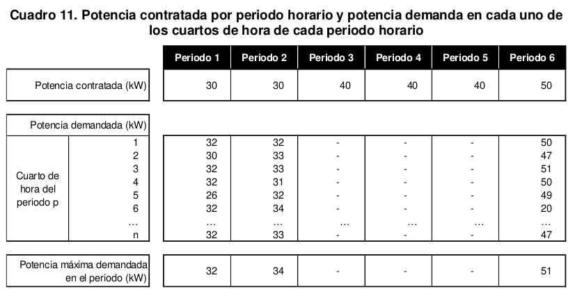

En caso de que el consumidor dispusiera de un equipo de medida tipo 4,
únicamente se registrará un valor para la potencia demandada en cada uno de
los periodos, que se corresponderá con la máxima de las potencias demandadas
en cada uno de los cuartos de hora de cada periodo y, como se ha indicado los

excesos de potencia se facturarán conforme a la fórmula establecida en el artículo 9.4.b.1)

$$
F_{EP}=\sum_{p=1}^{p=i}t_{e_p} \cdot2\cdot(Pd_p-Pc_P)
$$

Donde:

* $F_{EP}$ : Facturación en concepto de excesos de potencia
* $t_{ep}$ : Término de exceso de potencia, expresado en €/kW, del peaje correspondiente.
* $Pd_p$ : Potencia máxima demandada en cada uno de los períodos horario p en que se haya sobrepasado Pc p expresada en kW.
* $Pc_p$ : Potencia contratada en el período horario p , expresada en kW.
* $i$:Número de periodos horarios de los que consta el término de facturación de potencia del peaje correspondiente.

Esto es, para cada uno de los periodos horarios se compara la potencia
contratada con la potencia máxima demandada en el periodo y en caso de que
se produzcan excesos se procede a facturar el doble de la diferencia al precio
del término del exceso de potencia correspondiente a su peaje (en este caso, el
peaje 6.1 TD). Cabe señalar que, en la facturación de los excesos de potencia
para suministros tipo 4 y tipo 5 los precios de los excesos de potencia no tienen
discriminación horaria, se factura el mismo precio en todos los periodos en que,
en su caso, se hayan excedido de la potencia contratada. En el Cuadro 12 se
presenta la facturación del exceso de potencia que resulta para el ejemplo
considerado.

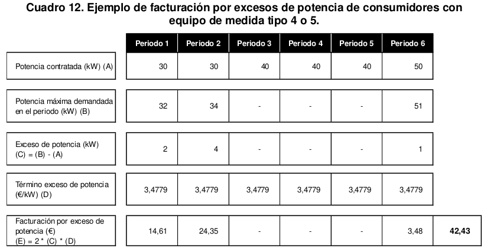

En caso de que el consumidor dispusiera en el punto de suministro de un equipo
de medida tipo 1, 2 o 3, se registra la potencia demandada por el consumidor en
cada uno de los cuartos de hora que integra el periodo horario y el exceso
registrado en cada uno de los cuartos de hora del periodo se facturará de
acuerdo con la fórmula establecida en el artículo 9.4.b.2)
				
$$
F_{EP}=\sum_{p=1}^{p=i}K_p \cdot t_{ep}\cdot\sqrt{\sum_{j=1}^{n}(Pd_j-Pc_P)^2}
$$

Donde:
F EP : Facturación en concepto de excesos de potencia
K P : Relación de precios por periodo horario p, calculada como el
cociente entre el término de potencia del periodo p respecto del
término de potencia del periodo 1 del peaje correspondiente.
t ep : Término de exceso de potencia, expresado en €/kW, del peaje
correspondiente.
Pd j : Potencia demandada en cada uno de los cuartos de hora j del
período horario p en que se haya sobrepasado Pc p , expresada en
kW. En el caso de que el equipo de medida no disponga de
capacidad de registro cuartohoraria, se considerará la misma
potencia demandada en todos los cuartos de hora.
Pc p : Potencia contratada en el período horario p , expresada en kW.
i:
Número de periodos horarios de los que consta el término de
facturación de potencia del peaje correspondiente.
En el Cuadro 13 se presenta la facturación del exceso de potencia que resulta
para el ejemplo considerado.

Por otra parte, como se ha indicado y así se recoge en la Memoria que acompaña
a la Circular 3/2020, con carácter general se mantienen las condiciones de
facturación de excesos de potencia vigentes. No obstante, al desvincular la
facturación por potencia contratada y excesos de potencia, se ha perdido la
vinculación temporal entre ambos términos. Es por ello que se ha hecho
necesario aclarar en el punto 2 del resuelve primero de la Resolución por la que
se establecen los valores de los peajes de transporte y distribución para el
ejercicio 2021, que la facturación por potencia demandada se realizará
mensualmente, prorrateándose por el número de días que comprende el periodo
de facturación, considerando que el día de lectura inicial está excluido y el día
de lectura final está incluido y que los meses son de 30 días. Este mismo criterio
será de aplicación en el caso de que se produzca una modificación de la potencia
contratada durante el ciclo de lectura.
En el caso de que se produjera un cambio de comercializador durante el ciclo de
lectura, el distribuidor deberá calcular, en su caso, la facturación por excesos de
potencia considerando el ciclo de lectura completo y asignar la totalidad de la
facturación por este concepto al comercializador entrante.

Por último, se indica que, los ejemplos mostrados en los cuadros 12 y 13
únicamente pretenden ilustrar el método de cálculo del término de facturación
por potencia demandada. La diferencia de la facturación bajo uno u otro
esquema dependerá del número de cuartos de hora que se exceda la potencia,
el exceso de la potencia demandada respecto de la potencia facturada y del
momento en que se produzca el exceso de potencia.

Por otra parte, como se ha indicado y así se recoge en la Memoria que acompaña
a la Circular 3/2020, con carácter general se mantienen las condiciones de
facturación de excesos de potencia vigentes. No obstante, al desvincular la
facturación por potencia contratada y excesos de potencia, se ha perdido la
vinculación temporal entre ambos términos. Es por ello que se ha hecho
necesario aclarar en el punto 2 del resuelve primero de la Resolución por la que
se establecen los valores de los peajes de transporte y distribución para el
ejercicio 2021, que la facturación por potencia demandada se realizará
mensualmente, prorrateándose por el número de días que comprende el periodo
de facturación, considerando que el día de lectura inicial está excluido y el día
de lectura final está incluido y que los meses son de 30 días. Este mismo criterio
será de aplicación en el caso de que se produzca una modificación de la potencia
contratada o cuando se produzca un cambio de temporada durante el ciclo de
lectura

Teniendo en cuenta las consultas recibidas al respecto, a continuación se
muestran algunos ejemplos de facturación por potencia demandada en el caso
de que el período de facturación no se corresponda con un ciclo mensual.

En el Cuadro 14 se presenta la facturación de un consumidor conectado en baja
tensión con potencia contratada es 10 kW (peaje 2.0 TD) de carácter no
interrumpible y cuya facturación es bimensual.

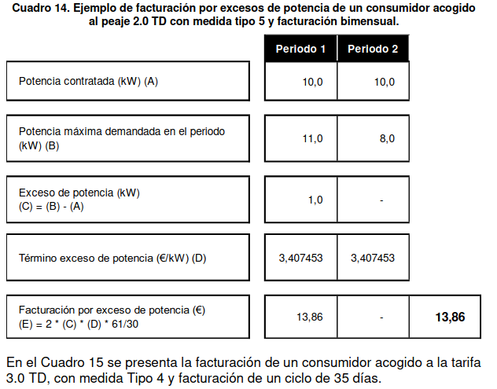

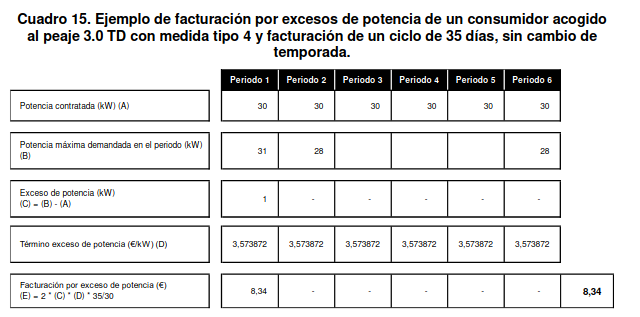

En el caso de que el ciclo de facturación no coincida con meses naturales y se
dé la circunstancia que se produzca un cambio de temporada entre meses, la
facturación por potencia demandada se prorrateará para cada período por el
número de días que dicho período ha estado activo dentro del ciclo de
facturación.
Cuadro 16. Ejemplo de facturación por excesos de potencia de un consumidor acogido
al peaje 3.0 TD con medida tipo 4 y facturación de un ciclo de 35 días con cambio de
temporada (del 29 de julio al 2 de septiembre)

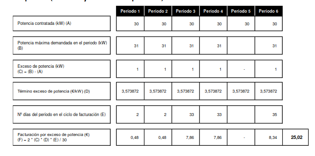

En el Cuadro 17 se presenta la facturación de un consumidor acogido a la tarifa
3.0 TD, con medida Tipo 4 para el que se tramita un cambio de potencia en mitad
de un ciclo de 30 días

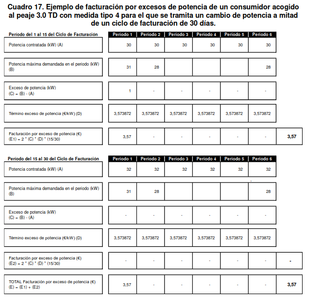

En el caso de que se produjera un cambio de comercializador durante el ciclo de
lectura, el distribuidor deberá calcular, en su caso, la facturación por excesos de
potencia considerando el ciclo de lectura completo y asignar la totalidad de la
facturación por este concepto al comercializador entrante.

### 6.4. Facturación por energía reactiva

La Circular 3/2020, de 15 de enero, mantiene las condiciones de facturación
energía reactiva establecidas en el artículo 9.3 del Real Decreto 1164/2001 12 en
tanto no se disponga de los resultados del grupo de trabajo de control de
tensión 13 creado en el ámbito de trabajo para la implementación de los
reglamentos europeos relativos a la gestión, con la salvedad de los dispuesto en
la disposición transitoria segunda relativa a la facturación por energía capacitiva
en el periodo de valle.
En consecuencia, se aplicarán las siguientes condiciones de facturación:
a) El término de facturación por energía reactiva es de aplicación a todos los
consumidores conectados en baja tensión con potencia contratada superior
a 15 kW y a los consumidores conectados en alta tensión.
b) Se aplicará sobre todos los períodos horarios, excepto el período 6,
siempre que el consumo de energía reactiva exceda el 33% del consumo
de activa durante el período de facturación considerado. Únicamente
afectará a esos excesos.
c) En el periodo de valle, todos los consumidores conectados en niveles de
tensión superior a 1 kV, es decir, todos los consumidores excepto aquellos
conectados en baja tensión, deberán mantener un factor de potencia
superior a 0,98 capacitivo en el período 6. Se aplicará una penalización de
0,05 Euro/kVArh fuera del rango anteriormente mencionado.
d) En la Resolución de precios que la CNMC publicará con la suficiente
antelación respecto de su entrada en vigor, se publicarán los precios
aplicables a la reactiva, que serán coincidentes con los actualmente
vigentes, en tanto no se disponga de los resultados del mencionado grupo
de trabajo.

Los términos de facturación por energía reactiva inductiva vigentes están
establecidos en el anexo I de la Orden ITC/688/2011, de 30 de marzo, por la que
se establecen los peajes de acceso a partir de 1 de abril de 2011 y determinadas
tarifas y primas de las instalaciones del régimen especial 14 :

El factor de potencia o cos  viene definido por la relación existente entre la
energía activa (E a ) y la energía reactiva (E r ) en cada uno de los periodos horarios
y se calcula conforme a la siguiente fórmula:

$$
cos \phi=\frac{E_a}{\sqrt{E_a^2+E_r^2}}
$$

Donde,
E a : Cantidad registrada por el contador de energía activa, expresada en
kWh.
E r : Cantidad registrada por el contador de energía reactiva, expresada en
kVArh.

Para el cálculo de la energía reactiva (Er) los equipos de medida registran la
energía reactiva de los cuadrantes I (QR1) y IV (QR4) por cada período horario.
La energía reactiva será el saldo neto obtenido como diferencia entre las
energías reactivas de los cuadrantes QR1 y QR4. Si la diferencia es positiva, el
factor de potencia es inductivo. En caso de resultar negativa, el factor de potencia
es capacitivo.

Los valores de esta fórmula se determinarán con dos cifras decimales y el
redondeo se hará por defecto o por exceso, según que la tercera cifra decimal
despreciada sea o no menor que 5.

A modo de ejemplo, en el cuadro inferior se muestra la facturación de energía
reactiva que resultaría para un consumidor considerando los precios
establecidos en la propuesta de Resolución.

Al respecto cabe señalar que, tal y como se recoge en la Memoria que acompaña
a la Resolución por la que se establecen los valores de los peajes de transporte
y distribución para el ejercicio 2021, teniendo en cuenta el impacto de la

disposición transitoria sobre determinados colectivos de consumidores, la
actualización prevista del Procedimiento de Operación 7.4 relativo al servicio
complementario de control de tensión de la red de transporte y la inminente
disposición de las conclusiones del grupo de trabajo de control de tensión, se
establece un precio de 0 €/kVAr para el término de facturación de energía
reactiva capacitiva en el periodo 6.

## 7. Peajes de aplicación a los contratos de duración inferior al año

Por lo que se refiere a los contratos de duración inferior a un año, la Circular
3/2020 únicamente establece la metodología de cálculo del recargo a aplicar a
los contratos de duración inferior a un año. La tipología de estos contratos
pertenece al ámbito de la regulación del acceso y, consecuentemente, dicha
regulación no se ha visto modificada por la Circular de peajes.
Conforme a la regulación vigente, los contratos de acceso a las redes son de
duración anual, prorrogándose tácitamente por períodos idénticos.
No obstante, se contemplan las siguientes excepciones en relación con la
duración de los contratos:
a) Contratos eventuales: aquellos que se establecen para menos de doce
meses, para un fin concreto, transitorio y esporádico como los
provisionales de obra, ferias u otros, circunstancia que se deberá
consignar en el contrato

b) Contratos de temporada: aquellos en los que se prevé una utilización
del suministro con una duración inferior a un año y de forma repetitiva en
los sucesivos años
c) Conexiones internacionales

La Circular 3/2020 establece que el término de potencia contratada aplicable a
los contratos cuya duración prevista en el momento de contratación sea inferior
al año, independientemente del tipo de contrato de que se trate, se
incrementarán los siguientes porcentajes:

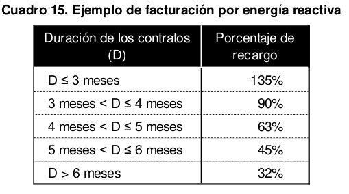

No obstante lo anterior, los contratos de duración inferior al año se facturarán
mensualmente aplicando el recargo correspondiente al contrato de duración
inferior a tres meses (esto es, los términos de potencia del peaje correspondiente
se incrementarían en un 135%) procediéndose simultáneamente en la última
factura a la regularización de los importes facturados.
A modo de ejemplo, un consumidor que formalizara un contrato de duración
estimada de cinco meses, sería facturado en las cuatro primeras facturas
considerando el recargo del contrato de duración inferior a tres meses (135%) y
en la quinta factura se procedería a la regularización de las cinco primeras
facturas emitidas (esto es, se consideraría un recargo de -72% para lo facturado
en las cuatro primeras facturas) y la facturación del último periodo considerando
el porcentaje correspondiente a la duración real del contrato (63%) (véase
Cuadro 20).

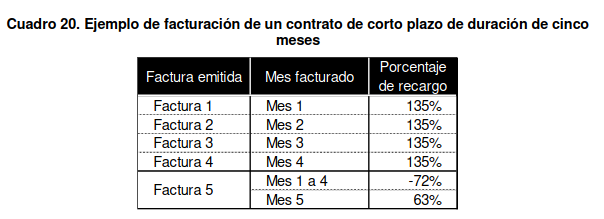

En caso de que el contrato de corto plazo superara el año de duración se debería
proceder a regularizar el término de potencia de los 12 meses anteriores, con
objeto de eliminar el recargo aplicado. De esta forma el término de potencia
aplicado sería el del peaje correspondiente sin ningún tipo de recargo.
Finalmente, conforme al resuelve segundo de la Resolución de precios para
2021, estos recargos aplicarán para los nuevos contratos suscritos a partir de la
entrada en vigor de los valores de peajes y cargos. A los contratos de menos de
un año en vigor con anterioridad a la aplicación de los peajes de transporte y

distribución establecidos en la resolución les serán de aplicación, una vez sean
aplicables los precios fijados por la CNMC, los periodos horarios de la Circular y
los precios de la Resolución. Hasta que sean de aplicación dichos precios
establecidos en la resolución de la CNMC, se les aplicarán los recargos y
condiciones particulares de aplicación establecidos en el artículo 6 del Real
Decreto 1164/2001, de 26 de octubre, por el que se establecen tarifas de acceso
a las redes de transporte y distribución de energía eléctrica.

## 8. Coeficientes de pérdidas

La Circular 3/2020 establece en el artículo 11 los coeficientes de pérdidas para
traspasar la energía suministrada en contador a energía suministrada en barras
de central a los efectos de las liquidaciones previstas en el Real Decreto
2019/1997, de 26 de diciembre, por el que se organiza y regula el mercado de
producción de energía eléctrica (véase Cuadro 21).

Los coeficientes de pérdidas estándar desagregados por nivel de tensión y
período horario elevan la energía demandada por el consumidor y, por tanto,
registrada en el contador a energía en barras de central. Estos coeficientes se
introdujeron en 1998 y han permanecido invariables desde entonces.
Ha sido, por tanto, necesario modificar dichos coeficientes al objeto de
adecuarlos, no solo, a los cambios introducidos por la Circular en la estructura
de peajes y en los períodos horarios sino también a los cambios en la estructura
de la generación que se han producido en los últimos veinte años.
El objetivo de la actualización de estos coeficientes de pérdidas estándar es
aproximarlos al valor de las pérdidas reales en las redes.
No obstante, Red Eléctrica de España seguirá publicando los archivos con los
valores horarios k de ajuste entre las pérdidas estándar y las pérdidas reales,
adaptándoles a la nueva estructura de peajes, períodos horarios y coeficientes
estándar. Estos valores k serán previsiblemente más bajos en la medida en que
las pérdidas estándar se acercarán más a las pérdidas reales.

## 9. Acreditación del punto de recarga del vehículo eléctrico de acceso público (Disposición adicional segunda)

La disposición adicional segunda de la Circular 3/2020 introduce un peaje
específico opcional de aplicación a los puntos de recarga de vehículos eléctricos
de acceso público, para lo que el titular del punto de suministro deberá acreditar:
\1) Que el punto de suministro será de utilización exclusiva para la recarga
de vehículos eléctricos.
\2) Que el punto de recarga será de acceso público.
A efectos anteriores, el titular del punto de suministro deberá aportar al
distribuidor, bien directamente, bien a través de un comercializador de su libre
elección, junto con la solicitud de contratación de acceso a la red el Boletín de la
instalación y una declaración en la que se ponga de manifiesto que el punto de
recarga será de acceso público y de uso exclusivo para la recarga de vehículos
eléctricos, a efectos de la aplicación del peaje por parte del distribuidor.
Se indica que de acuerdo con lo establecido en el punto quinto de la citada
disposición adicional segunda, en el caso de que se detectara que el punto de
suministro no es de dedicación exclusiva a la recarga de vehículos eléctricos de
acceso público, se procederá a la refacturación de todos los consumos desde el
momento inicial de la aplicación del peaje específico de recarga de vehículos
eléctricos aplicando los términos de potencia, energía activa, potencia
demandada y energía reactiva que correspondieran al peaje de aplicación al
punto de suministros incrementados los precios en un 20%.
Se considera que el punto de suministro es de uso exclusivo para la recarga de
vehículos eléctricos cuando su consumo se dedica a la recarga de vehículos y a
los consumos propios asociados a dicho punto de recarga. Esto es, se contempla
la posibilidad de que exista un consumo/potencia residual para otros usos
asociados dentro del contrato como por ejemplo farolas de iluminación, con
objeto de evitar el impacto sobre la penetración de los puntos de recarga de
acceso público derivado de la obligación de contratar un segundo punto de
suministro. Al respecto cabe recordar que el diseño de los peajes de aplicación
a los puntos de suministro dedicados con exclusividad a la recarga de vehículos
eléctricos se ha diseñado para que a partir de una utilización de potencia superior
al 10% (el equivalente aproximado a 5 recargas diarias) sea más rentable la
aplicación del peaje general.

## 10. Entrada en vigor

La Circular 3/2020, de 15 de enero, entró en vigor al día siguiente de su
publicación en el Boletín Oficial del Estado. No obstante, a efectos de

proporcionar a los agentes un periodo de tiempo suficiente para la adaptación de
los equipos de medida, los sistemas de facturación y de los contratos de los
consumidores a la estructura de los peajes de acceso a las redes de transporte
y distribución establecidos en la Circular, se estableció un periodo transitorio que
se prolongó hasta el 1 de junio de 2021, fecha en la que fueron de aplicación los
cargos aprobados por el Ministerio para la Transición Ecológica y el Reto
Demográfico, a fin de aclarar que, en todo caso, hasta que sean de aplicación
los valores de dichos cargos, se aplicarán los peajes de acceso y las condiciones
de facturación vigentes con anterioridad a la entrada en vigor de la citada Circular
3/202015.
Las distribuidoras han debido comunicar con anterioridad a las
comercializadoras qué peaje aplicará a partir de la efectiva aplicación de peajes
y cargos, especialmente para el caso de los suministros con peaje vigente 3.1 A,
que deberán determinar si pasan a facturarles según peaje 6.1TD o 6.2TD,
dependiendo del nivel de tensión.

## 11. Periodo transitorio

La disposición transitoria primera de la Circular 3/2020, relativa a la adaptación
de los equipos de medida, los sistemas de facturación y los contratos establece
el periodo para la adaptación a la estructura de peajes de la misma y las
condiciones de facturación que se deben aplicar en tanto no se produzca dicha
adaptación.
Teniendo en cuenta las consultas en relación con el periodo transitorio recibidas
por parte de los distintos agentes desde la publicación de la Circular 3/2020 se
hace necesario aclarar los siguientes aspectos:

### Respecto de la adaptación de los equipos de medida

Las empresas distribuidoras dispusieron hasta el 1 de junio de 2021 para
adaptar los equipos de medida a la estructura de peajes definidos en la
Circular.
En aquellos casos en que no haya sido posible la adaptación del equipo de
medida a la estructura de peajes de la Circular (contadores no sustituidos,
contadores sin curva horaria, contadores cuya programación no haya sido
posible con anterioridad al 1 de junio o fallos de programación de los
contadores), la facturación de peajes de acceso se realizará a partir de los
datos obtenidos de sus lecturas

En particular, para los consumidores con equipo de medida con capacidad
de registro horario, la energía por periodo horario se obtendrá a partir de la
curva de carga horaria según los periodos conforme al calendario definido en
el artículo 7 de la Circular.

Cuando el consumidor no dispusiera de equipo de medida horario
efectivamente integrado, el consumo real de acuerdo con la estructura de
periodos vigentes se convertirá a los periodos conforme a los calendarios
definidos en el artículo 7 de la Circular 3/2020 aplicando los porcentajes de
conversión que se han establecidos a los efectos en la Resolución de precios.
En el caso de aquellos puntos de suministro acogidos al peaje 2.0 TD que no
dispongan de equipo de medida integrado en los sistemas de telegestión por
causa imputable al consumidor y, dispongan por tanto de un único interruptor
de control de potencia, estos no podrán contratar potencias diferenciadas por
periodo horario16.
En el caso de aquellos puntos de suministro acogidos al peaje 2.0 TD que
dispongan de equipo de medida integrado en los sistemas de telegestión y
también dispongan de un único interruptor de control de potencia, las
empresas distribuidoras procederán a eliminar el citado dispositivo según los
plazos establecidos en el artículo 103 del Real Decreto 1955/2000, desde la
solicitud de contratación de potencias diferenciadas por periodo h.
Finalmente, se indica que conforme al artículo 13.2 del Real Decreto
1110/2007, por el que se aprueba el Reglamento unificado de puntos de
medida del sistema eléctrico, independientemente de si el contador
pertenece al consumidor o es alquilado a la empresa distribuidora, la empresa
distribuidora, como encargada de la lectura del contador, será responsable
de realizar la programación del contador acorde a las disposiciones de la
nueva Circular.

### Respecto de la adaptación de las potencias contratadas a la nueva estructura de peajes

En tanto los consumidores no modifiquen sus contratos de acceso se
mantendrán las potencias contratadas. No obstante, a efectos de la
aplicación de los peajes, será necesaria la adaptación de las mismas a la
estructura de peajes de la Circular. En particular, la adaptación de las
potencias

a) En el caso de consumidores conectados en baja tensión con potencia
contratada inferior o igual a 15 kW (anteriores peajes 2.0 A y 2.1 A), dado
que bajo la estructura actual de peajes de acceso anterior únicamente se
contrata una potencia, se considerará la misma potencia en los periodos
de punta y valle.
Por ejemplo, el consumidor tuviera contratada una potencia de 4,0 kW
pasaría bajo la nueva estructura de peajes a ser facturado considerando
una potencia contratada en punta de 4,0 kW y una potencia contratada en
valle de 4,0 kW

b) En el caso de los consumidores conectados en baja tensión con potencia
contratada superior a 15 kW (anterior peaje 3.0 A) y los conectados en
tensión comprendida entre 1 y 36 kV con potencia contratada igual o
inferior a 450 kW en todos los periodos (anterior peaje 3.1) se procederá
de la siguiente manera:
i. La potencia contratada del periodo 1 del peaje de seis periodos será
igual a la potencia contratada en el periodo 1 del peaje al que
estuviera acogido el consumidor a la entrada en vigor de la circular.
ii. La potencia contratada en los periodos 2, 3, 4 y 5 del peaje de seis
periodos será igual a la potencia contratada en el periodo 2 peaje al
que estuviera acogido el consumidor a la entrada en vigor de la
circular. En caso de incumplir el criterio de potencias crecientes, la
potencia contratada en los periodos 2, 3, 4 y 5 será igual a la potencia
contratada en el periodo 1.
iii. La potencia contratada en el periodo 6 del peaje en seis periodos
será igual a la potencia contratada en el periodo 3 del peaje al que
estuviera acogido el consumidor a la entrada en vigor de la circular.
En caso de incumplir el criterio de potencia crecientes, la potencia
contratada en el periodo 6 será igual a la potencia contratada en el
periodo 5.

A modo de ejemplo, un consumidor acogido anteriormente al peaje de
acceso 3.0 A17 que tuviera contratados 15 kW, 20 kW y 15 kW en los
periodos 1, 2 y 3, respectivamente, pasaría a ser facturado al peaje de
transporte y distribución de la Circular considerando 15 kW en el periodo
1 y 20 kW en los periodos 2, 3, 4, 5 y 6.

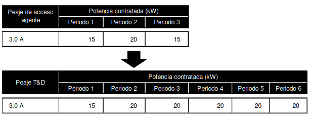

Un consumidor acogido anteriormente a los peajes de acceso 3.0 A o 3.1
A que tuviera contratados 15 kW, 20 kW y 30 kW en los periodos 1, 2 y 3,
respectivamente, pasaría a ser facturado al peaje de transporte y
distribución de la Circular considerando 15 kW en el periodo 1, 20 kW en
los periodos 2, 3, 4 y 5 y 30 kW en el periodo 6.

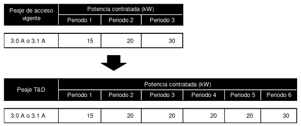

c) Para el resto de consumidores se mantendrán las potencias contratadas
por periodos horarios.

###  Respecto del coste de la adaptación de las potencias contratadas a la nueva estructura de peajes

Adicionalmente, en el punto 2 de la citada disposición transitoria primera se
establece que el consumidor tendrá derecho a adaptar las potencias
contratadas por periodo horario a los periodos horarios definidos en la
Circular 3/2020, sin coste alguno, independientemente de si hubiera realizado
un cambio de potencia en los doce meses anteriores.
Al respecto se hace necesario aclarar que los consumidores podrán modificar
dos veces las potencias contratadas con objeto de adaptarlas a los periodos
horarios definidos en la Circular 3/2020 durante el periodo de doce meses a
contar desde 1 de junio de 2021, a pesar de no haber transcurrido doce
meses desde la última adaptación de las potencias.
Estas modificaciones no tendrán coste siempre que no se supere la mayor
de las potencias que el consumidor tuviera contratadas con anterioridad al 1
de junio de 2021. Para que sean gratuitos los dos cambios han de realizarse
en el período comprendido entre el 1 de junio de 2021 y el 31 de mayo de
\2022. Agotados estos dos cambios, las modificaciones de potencia tendrán
el coste que corresponda según la normativa vigente.
En el caso de que la nueva modificación de potencia no supere la máxima de
las potencias contratadas por el consumidor en el momento del cambio, no
se aplicará lo dispuesto en el artículo 83.5 del Real Decreto 1955/2000, de 1
de diciembre, por el que se regulan las actividades de transporte, distribución,
comercialización, suministro de electricidad y procedimientos de autorización
de instalaciones de energía eléctrica, sobre la revisión de las instalaciones
de más de veinte años.
En caso de que la potencia contratada supere en algún período la máxima de
las potencias contratadas con anterioridad al 1 de junio de 2021, el
consumidor deberá abonar el coste de los derechos de acometida aplicables
y el derivado de eventuales cambios o actuaciones sobre los equipos de
control y medida, con arreglo a la normativa que sea de aplicación.

No obstante lo anterior, y dado que en el caso de aumentos de potencia para
consumidores que cuenten con equipos de medida telegestionados no sería
necesaria una actuación in situ en el domicilio del consumidor por parte de
las empresas distribuidoras, y salvo que dicha actuación fuera acompañada
de alguna otra que sí requiriera una actuación manual en el contador y por
tanto fuera necesario un desplazamiento, no cabría el cobro de derechos por
actuaciones18 en los equipos de medida y control previstos en el Real Decreto
1048/2013.

Los derechos de acometida son aquellos pagos que se deben realizar al
distribuidor por atender un nuevo suministro o por el incremento de potencia
de un suministro ya existente. Los derechos de acometida incluyen:
a) Los derechos de acceso son la contraprestación económica asociada a la
gestión administrativa del punto de suministro por parte del distribuidor.
b) Los derechos de extensión son la contraprestación económica por uso de
las instalaciones necesarias para atender el suministro

Los derechos de actuación constituyen la contraprestación económica por
la conexión y precintado de los equipos de medida, así como las actuaciones
que se deban realizar en el contador derivadas de las decisiones del
consumidor.
Los derechos de acometida y los derechos de actuación están establecidos
en el Anexo V de la Orden ITC/3519/2009, de 28 de diciembre, por la que se
revisan los peajes de acceso a partir de 1 de enero de 2010 y las tarifas y
primas de las instalaciones del régimen especial (véase Cuadro 22)

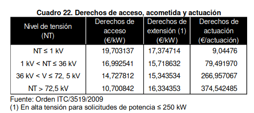

Se señala que los niveles de tensión que se presentan en el citado Anexo V
no se corresponden con la estructura de peajes por nivel de tensión fijada en
la Circular 3/2020. En consecuencia, un consumidor acogido al peaje 6.2 TD
tendrá que hacer frente a costes distintos en función del nivel de tensión al
que el cliente se encuentre conectado (menor o igual a 36 kV, entre 36 kV y
72,5 kV y mayor que 72,5 kV).
A continuación, se ilustra con seis ejemplos cuál sería el importe a abonar en
la adaptación de potencias:

Ejemplo I: Un consumidor acogido a la tarifa 2.0 TD con un contador
telegestionado que, a 1 de junio de 2021, tiene una potencia contratada de 5
kW en Punta y Valle.
\1) Utiliza su primer cambio para reducir su potencia en punta y valle a 4 kW
\2) Utiliza su segundo cambio para aumentar de nuevo su potencia hasta 5
kW en valle.

Ejemplo II: Un consumidor acogido a la tarifa 2.0 TD con un contador
telegestionado que, a 1 de junio de 2021, tiene una potencia contratada de 5
kW en Punta y Valle.
\1) Utiliza su primer cambio para reducir su potencia en punta y valle a 4 kW
\2) Utiliza su segundo cambio para aumentar su potencia a 6 kW en valle. El
incremento hasta 5 kW es gratuito. Por el incremento entre 5 kW y 6 kW
debería abonar derechos de acceso y de extensión.

Ejemplo III: Un consumidor acogido a la tarifa 2.0 TD con un contador
telegestionado que, a 1 de junio de 2021, tiene una potencia contratada de 5
kW en Punta y Valle.
\1) Utiliza su primer cambio para para aumentar su potencia a 6 kW en valle.
Deberá abonar derechos de acceso y extensión por el incremento de la
potencia (1 kW)
\2) Utiliza su segundo cambio para reducir la potencia de punta y valle.
\3) Solicita un tercer cambio (no gratuito) para aumentar de nuevo la potencia
de valle hasta 6 kW.

Ejemplo IV: Un consumidor acogido a la tarifa 2.0 TD con un contador
telegestionado que con anterioridad al 1 de junio de 2021 solicita una
reducción de potencia de 5 a 4 kW.
\1) Utiliza su primer cambio para para aumentar su potencia a 6 kW en valle.
Deberá abonar derechos de acceso y extensión por el incremento de la
potencia (1 kW).
\2) Utiliza su segundo cambio para reducir la potencia de punta y valle.

Ejemplo V: Consumidor acogido a la tarifa 6.1 TD conectado a tensión
comprendida entre 1 y 30 kV.
\1) Utiliza su primer cambio para para reducir la potencia del periodo 1.
\2) Utiliza su segundo cambio para reducir la potencia del periodo 6.
\3) Utiliza un tercer cambio (no gratuito) para aumentar la potencia de los
periodos 1 a 6, sin sobrepasar la mayor de las contratadas con
anterioridad al 1 de junio de 2021.

Ejemplo VI: Consumidor acogido a la tarifa 6.1 TD conectado a tensión
comprendida entre 1 y 30 kV.
\1) Utiliza su primer cambio para para reducir la potencia del periodo 1 y
aumentar la potencia de los periodos 2 a 5.
\2) Utiliza su segundo cambio para aumentar la potencia de los periodos 5 y
6.

A partir del 1 de junio de 2022, de conformidad con la normativa aplicable, el
cliente podrá incrementar su potencia las veces que lo necesite, si bien el
distribuidor podrá negarle el cambio si no hubieran transcurrido doce meses
desde el último cambio. Por el contrario, solo podrá reducir la potencia una
vez cada doce meses.
Los clientes que reduzcan su potencia deberán hacer frente a los costes de
actuación que corresponda.
Las adaptaciones de potencia que supongan un incremento de potencia
respecto a la contratada en el momento del cambio deberán abonar los
derechos de acceso, los derechos de extensión y los costes de actuación,
según se establezca.
Tras una reducción de potencia, si el consumidor decide incrementar la
misma volviendo a la potencia inicial antes de haber transcurrido tres años
en el caso de baja tensión o cinco años en el caso de alta tensión, debería
de hacer frente únicamente a los derechos de acceso y derechos de
actuación ya que los derechos de extensión seguirían vigentes. En el caso
de que hubieran transcurrido más de tres años o cinco años,
respectivamente, también deberían de hacer frente a los costes de
extensión.

### Respecto de la adaptación de las potencias máximas registradas a la nueva estructura de peajes

En aquellos casos en que no haya sido posible la adaptación del equipo de
medida, las potencias demandadas correspondientes a cada periodo horario

se obtendrán de la curva de carga cuartohoraria, o alternativamente de la
curva de carga horaria si no se dispone de ésta, según los periodos conforme
al calendario definido en el artículo 7 de la Circular 3/2020. La potencia
demandada se facturará conforme a lo establecido en el punto el artículo 9.4
de la Circular 3/2020.
En el caso de puntos de suministro sin equipo de medida horario
efectivamente integrado, las potencias registradas por los maxímetros
conforme a estructura de peajes del Real Decreto 1164/2001 se convertirán
a la estructura de la Circular 3/2020 aplicando las siguientes reglas:

i) Para los suministros conectados en baja tensión con potencia
demanda contratada igual o inferior a 15 kW, la potencia demanda de
los periodos de punta y valle se corresponderá con potencias
registrada por el maxímetro.
ii) Para los suministros conectados en baja tensión con potencia
contratada superior a 15 kW y los conectados en tensión comprendida
entre 1 y 36 kV con potencia contratada igual o inferior a 450 kW en
todos los periodos:
a. La potencia demandada del periodo 1 se corresponderá con la
potencia demandada del periodo 1 del peaje al que estuviera
acogido el consumidor hasta la entrada en vigor de la Resolución.
b. La potencia demandada de los periodos 2, 3, 4 y 5 del peaje de
seis periodos se corresponderá con la potencia demandada del
periodo de llano del peaje al que estuviera acogido el consumidor
hasta la entrada en vigor de la Resolución.
c. La potencia demandada del periodo 6 se corresponderá con la
potencia demandada del periodo de valle del peaje al que
estuviera acogido el consumidor hasta la entrada en vigor de la
Resolución.
iii) La facturación por potencia demandada se realizará conforme al punto
9.4.b.1) de la Circular 3/2020.

### Respecto de la adaptación de los sistemas de facturación

Respetando el ciclo de facturación, las empresas distribuidoras deberán
remitir dos facturas: una con el consumo correspondiente hasta la fecha de
aplicación de los nuevos peajes, aplicando los peajes anteriores, y otra desde
la fecha de aplicación de los nuevos peajes, hasta el fin del ciclo de
facturación, aplicando los nuevos peajes

### Respecto de la información a los consumidores

El apartado cuarto de la Disposición Transitoria primera establece que las
empresas comercializadoras informarán de forma clara y transparente a los
consumidores de la nueva estructura de peajes.
La información a remitir debería centrarse, al menos, los siguientes aspectos,
(i) el cambio de peajes aplicable, (ii) los nuevos periodos tarifarios aplicables,
(iii) separación de los peajes de acceso en peajes de transporte y distribución
y cargos (iii) adaptación en las condiciones contractuales consecuencia de
las modificaciones anteriores.
La diversidad de situaciones no ha hecho posible establecer un modelo
estandarizado de comunicación, pero, en cualquier caso, la comunicación
deberá ser fácilmente comprensible por un consumidor medio evitando la
utilización de terminología farragosa o de difícil comprensión.
Asimismo, se sugiere incluir en la comunicación los medios de contacto que
establezca la comercializadora para aclarar sus posibles dudas, así como un
link al presente documento.

## 12. Adaptación de los contratos de suministro

En relación con la adaptación de los contratos de suministro a la estructura de
peajes de la Circular 3/2020, se indica que la Disposición transitoria primera de
la citada Circular establece, tras su modificación por la Circular 3/2021, que “Las
empresas distribuidoras y comercializadoras adaptarán los equipos de medida,
los sistemas de facturación y los contratos a lo dispuesto en esta circular antes
del 1 de junio de 2021”.
En consecuencia, antes de la citada fecha las empresas distribuidoras han
debido adaptar los equipos de medida y los sistemas de facturación, mientras
que las empresas comercializadoras, además, han debido adaptar los contratos
de sus clientes. Es decir, han debido, en su caso19, adaptar el coste de la energía
que haya libremente pactado con el consumidor bajo la anterior estructura a la
nueva estructura de peajes y cargos.
Se indica que esta adaptación de los contratos afecta a los consumidores que
tengan contratado su suministro con un comercializador libre, ya que el Real
Decreto por el que se establece la metodología de cargos modifica el Real
Decreto 216/2014 a efectos de adaptar la estructura del PVPC a la nueva
estructura de peajes y cargos.

En relación con los contratos firmados entre las comercializadoras y los
consumidores se debe tener en cuenta que las adaptaciones necesarias
dependerán de (i) las condiciones contractuales establecidas entre las partes, (ii)
el perfil de consumo del punto o puntos de suministro afectados, (iii) las
modificaciones que el cambio de los periodos horarios induzca en el
comportamiento del consumidor, (iv) las modificaciones introducidas o a
introducir en el resto de componentes regulados que forman parte del coste de
la energía (retribuciones al operador del mercado y al operador de sistema, y
pagos por capacidad).
Un aspecto relevante en el proceso de adaptación de los contratos es el perfil de
consumo del punto de suministro. Si la CNMC estableciera unos coeficientes de
adaptación que permitieran convertir los precios de energía con la estructura
establecida en la Orden ITC/2794/2007 a los que correspondería conforme a la
estructura de peajes de la Circular 3/2020, únicamente podría tener en cuenta el
perfil medio del de cada grupo de peajes, dado que es la única información de la
que dispone, lo que podría beneficiar o perjudicar a las empresas
comercializadoras, en la medida en que estas habrán presentado sus ofertas
teniendo en cuenta el perfil concreto de los suministros a los que van a
abastecer.
Teniendo en cuenta las consideraciones anteriores y que los precios de los
contratos por el suministro de energía se corresponden con el componente
liberalizado y que ha sido libremente acordado entre consumidor y
comercializador, cabe concluir que la CNMC no tiene competencias para
establecer las adaptaciones necesarias a los mismos.
Al respecto, se indica que deben ser las empresas comercializadoras las que se
dirijan a los consumidores y les informe adecuadamente sobre la nueva
estructura de peajes y cargos y el impacto sobre los precios por el componente
de energía pactados con los mismos

## ANEXO I. PRECIOS DE LOS PEAJES DE TRANSPORTE Y DISTRIBUCIÓN. AÑO 2021

### Anexo I. Precios de los términos de potencia contratada y de energía activa

#### 1. Precios de los términos de potencia contratada y energía activa de los peajes de transporte y distribución de aplicación a los consumidores, a
los autoconsumidores por la energía demandada de la red y a los generadores por los consumos propios

##### a) Términos de potencia contratada:

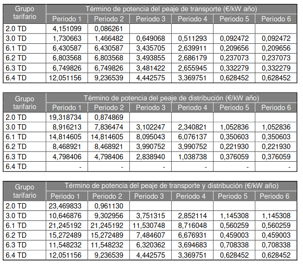

##### b) Los términos de energía:

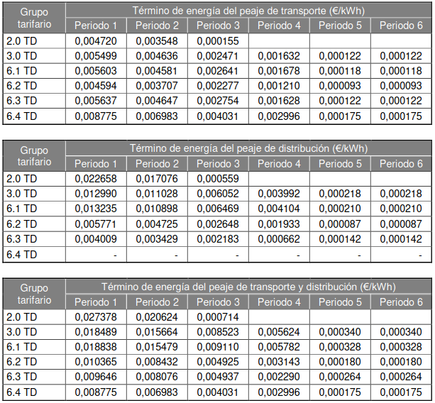

#### 2. Precios los términos de energía de los pagos de autoconsumidores por la energía autoconsumida en el caso instalaciones próximas a través de red

#### 3. Precios de los términos de potencia contratada y de energía de los peajes de aplicación a los puntos de suministro de acceso público dedicados a la recarga de vehículos eléctricos

##### a) Puntos de recarga de vehículos eléctricos conectados en baja tensión:

##### b) Puntos de recarga de vehículos eléctricos conectados en media tensión:

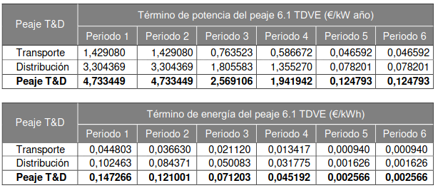

## Referencias

 [CNS/DE/1467/20: CONSULTAS VARIAS SOBRE LA IMPLEMENTACIÓN DE LA CIRCULAR 3/2020 DE 15 DE ENERO POR LA QUE SE ESTABLECE LA METODOLOGÍA PARA EL CÁLCULO DE LOS  PEAJES DE TRANSPORTE Y DISTRIBUCIÓN DE ELECTRICIDAD](https://www.cnmc.es/expedientes/cnsde146720) 

## Informes

???+ Abstract "Factura de la luz"
    !!! Warning "Editar informe ($t_{1^a\ carga}\leq 15s.$) "
